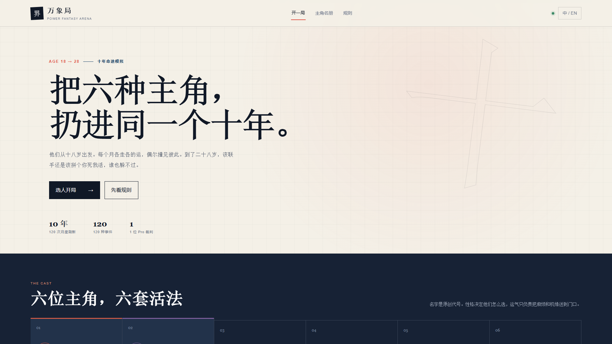
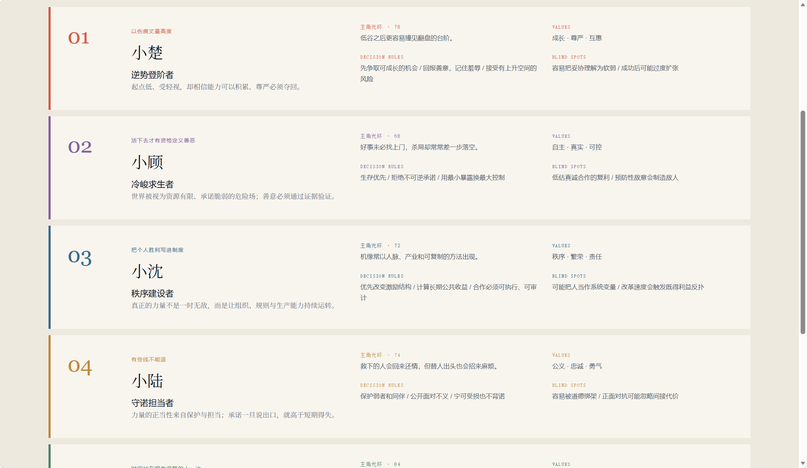
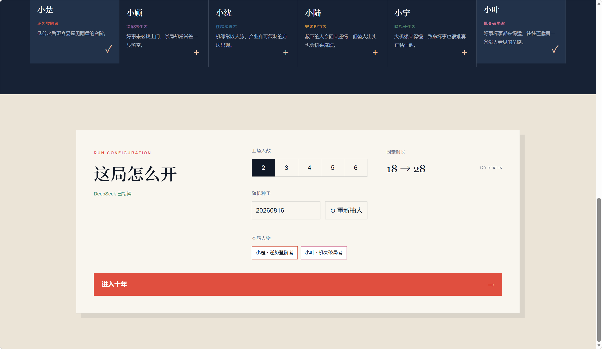

# Power Fantasy Arena

[English](README.md) | [Chinese](README.zh-CN.md)

Power Fantasy Arena is a local AI board game about six original web-fiction protagonists sharing one world for ten years. Each character starts at 18, draws a different event every month, and reaches the final reckoning at 28. They may cooperate, collide, or spend a decade carefully making enemies.

This is a game, not a group chat with character portraits. Every protagonist has values, blind spots, decision rules, memory, and a luck profile that changes the events they are likely to draw.



## How a run works

Choose two to six protagonists and a random seed. A full run lasts 120 months.

- Each protagonist receives a separate monthly event.
- DeepSeek V4 Flash chooses the character's response. One DeepSeek V4 Pro judge resolves the outcome.
- The event library contains 30 web-fiction story patterns at four intensity levels, for 120 event variants.
- Luck changes the odds of fortunate, hostile, and mixed events.
- Characters may meet around month 40, meet more often after month 80, and must converge in month 120.
- Context is reorganized every six months. Character definitions stay intact while recent history and durable memories are stored separately.



## Run it locally

On Windows, the quickest route is `start-game.cmd`. Double-click it to start the local server and open the game. Close the command window when you are done.

For a terminal setup:

1. Copy `.env.example` to `.env.local`.
2. Add your DeepSeek API key to `.env.local`.
3. Run `npm install`.
4. Run `npm run dev`.
5. Open `http://localhost:3000`.

Node.js 22.13 or newer is required.

```env
DEEPSEEK_API_KEY=your_key_here
```

The key is read only by the local API route. It is not sent to browser code or written into run archives. `.env.local` is ignored by Git.



## What the game saves

Each run gets its own folder under `runs/<run-id>/`:

- `report.md` is the readable account, suitable for review or video planning.
- `timeline.json` contains the complete month-by-month record.
- `summary.json` contains the ending and final statistics.

The archive records public reasons, cited memories, rejected options, risk estimates, and the judge's ruling. It does not request or store hidden chain-of-thought.

## Development commands

```bash
npm run dev
npm run build
npm test
npm run lint
npm run db:generate
```

The app uses React 19, TypeScript, Vinext, Vite, Drizzle ORM, and the Cloudflare Vite plugin. See [RESEARCH.md](RESEARCH.md) for the event taxonomy, source notes, and model-interface checks.

## License

[MIT](LICENSE)
